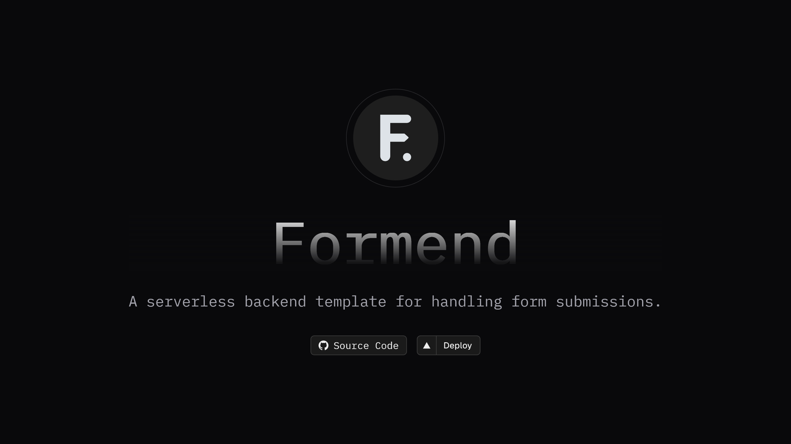

# Formend

A self-hostable serverless backend for handling form submissions.

Built using [Flask](https://flask.palletsprojects.com/en/), and a PostgreSQL database (powered by [Vercel Postgres](https://vercel.com/storage/postgres)) and deployed to [Vercel](https://vercel.com).

